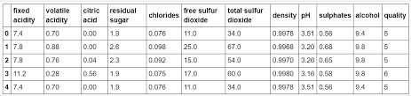

# Wine-Quality-Checker
This is a dataset form Kaggle consisting data of 75% of white wine and 25% of red wine.

The dataset sontains information about the fixed acidity, volatile acidity, citric acid, residual sugar, chlorides, free sulfur dioxide, total sulfur dioxide, density, pH, sulphates, alcohol.

Used __seaborn__ for the visualization of the correlation of the columns in dataset.
And used __boxplot__ to show distribution with respect to categories.

We then fit different models to check which model has the highest accuracy. We used __Simple Linear Regression__ and __Multiple Lnear Regression with Lasso Regression__

I did a variety of classification for the model to check for the highest accuracy.
Following are the different clasifcation i implemented on the model.
1) __K-Nearest Neighbors__
2) __Naive Bayes__
3) __Logistic Regression__
4) __Decision Tree Classifier__ 
5) __Random Forest Classifier__

And the highest accuracy was of __Random Forest Classifier__. And one of the reasons as to why our models perform poorly is due to the highly subjective nature of the dataset. We can also possibly improve these results by using different models or tweaking the hyperparameters of our current models.
